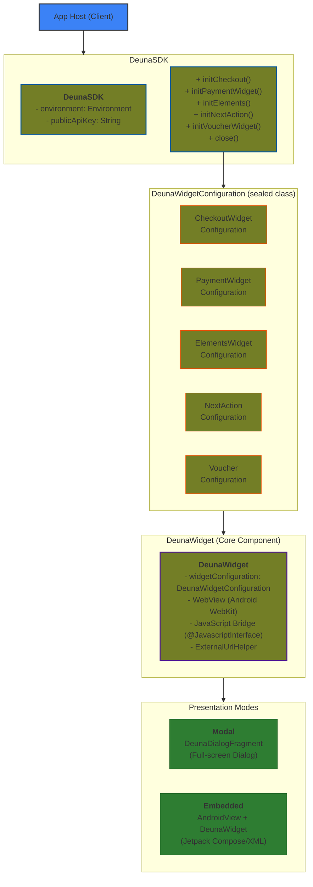
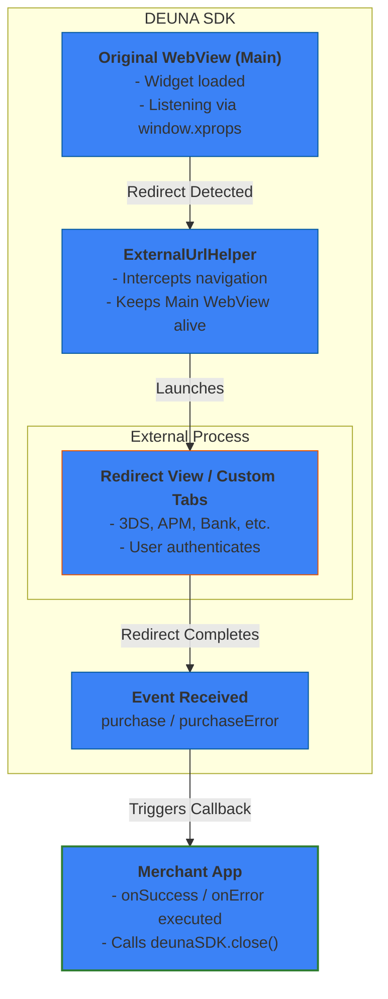
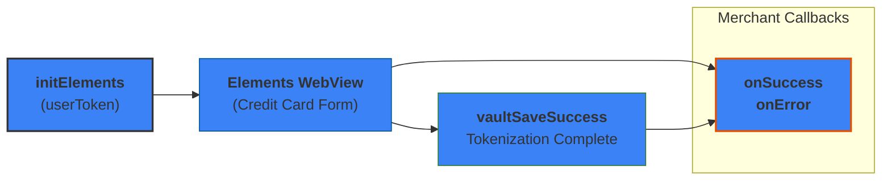

# DEUNA SDK Android - Technical Architecture Documentation

## General Information

| **Platform** | Android 6+ (API 24+) |
| --- | --- |
| **Language** | Kotlin 1.9.22 |
| **Dependency Manager** | Gradle / Maven Central |
| **Repository** | https://github.com/DUNA-E-Commmerce/deuna-sdk-android |
| **Current Version** | 2.9.15 |

## 1. SDK Architecture

### 1.1. Architectural Pattern

The SDK uses a **WebView-based architecture with Callback pattern**. It does not strictly follow MVVM or Clean Architecture, but rather a pragmatic approach oriented to:

- **Main class** (`DeunaSDK`) supporting both **singleton** and **instance-based** usage.
- **Core widget component** (`DeunaWidget`) that renders any DEUNA widget based on its configuration.
- **Configuration classes** (`DeunaWidgetConfiguration` subclasses) that determine which widget type to display.
- **Two presentation modes**: Modal (via `DeunaDialogFragment`) or Embedded (via Jetpack Compose/XML).
- **JavaScript ↔ Kotlin communication** via `@JavascriptInterface` bridges.
- **Callback system** to notify events to the host app.



**Key Concept:** The `DeunaWidgetConfiguration` determines **what** widget to show (Checkout, Payment, Elements, etc.), while the presentation mode determines **how** to show it (Modal or Embedded). The `DeunaWidget` is the core component that renders any widget type based on its configuration.

### 1.2. Directory Structure

```markdown
sdk/src/main/java/com/deuna/maven/
├── DeunaSDK.kt                    # Main class (Singleton + Instance)
├── InitCheckout.kt                # Checkout extension to show the checkout widget as dialog fragment
├── InitPaymentWidget.kt           # Payment widget extension to show the payment widget as dialog fragment
├── InitElements.kt                # Vault/elements extension to show the vault/elements widget as dialog fragment
├── initNextAction.kt              # Next action extension to show the next action widget as dialog fragment
├── initVoucherWidget.kt           # Voucher extension to show the voucher widget as dialog fragment
├── GenerateFraudId.kt             # Fraud ID generation through a web view that executes the DEUNA CDL script
│
├── shared/                        # Shared components
│   ├── Callbacks.kt               # Callback types and base classes used by multiple widgets
│   ├── Environment.kt             # Environment configuration (DEVELOPMENT, STAGING, SANDBOX, PRODUCTION)
│   ├── PaymentsError.kt           # Error types for the Payment Widget, Checkout Widget, etc.
│   ├── Constants.kt               # Global constants, error messages, query parameters
│   ├── NetworkUtils.kt            # Network utilities for connectivity checks
│   ├── DeunaLogs.kt               # Logging system
│   ├── WebViewBridge.kt           # Abstract base class for JavaScript bridges
│   ├── Utils.kt                   # URL building utilities
│   ├── JsonParser.kt              # JSON parsing utilities
│   ├── typealias.kt               # Type aliases (Json = Map<String, Any>)
│   ├── domain/
│   │   └── UserInfo.kt            # User information data class for vault authentication
│   ├── enums/
│   │   └── enums.kt               # Enumerations (CloseAction: userAction, systemAction)
│   └── extensions/
│       └── ContextExtensions.kt   # Context extension functions
│
├── widgets/                       # Widget configurations and bridges
│   ├── configuration/
│   │   ├── Base.kt                # Base sealed class DeunaWidgetConfiguration
│   │   ├── CheckoutWidgetConfiguration.kt
│   │   ├── PaymentWidgetConfiguration.kt
│   │   ├── ElementsWidgetConfiguration.kt
│   │   ├── NextActionWidgetConfiguration.kt
│   │   └── VoucherWidgetConfiguration.kt
│   ├── checkout_widget/
│   │   ├── CheckoutWidgetDialogFragment.kt # Class that extends of BaseDialogFragment and uses a CheckoutWidgetConfiguration
│   │   ├── CheckoutEvent.kt       # Events for checkout, payment widget, next action and voucher
│   │   └── CheckoutBridge.kt      # JavaScript bridge for checkout events
│   ├── payment_widget/
│   │   ├── PaymentWidgetDialogFragment.kt # Class that extends of BaseDialogFragment and uses a PaymentWidgetConfiguration
│   │   └── PaymentWidgetBridge.kt     # JavaScript bridge for payment widget events
│   ├── elements_widget/
│   │   ├── ElementsWidgetDialogFragment.kt # Class that extends of BaseDialogFragment and uses a ElementsWidgetConfiguration
│   │   ├── ElementsEvent.kt       # Events for the elements widget (vault & click to pay)
│   │   ├── ElementsError.kt       # Elements-specific error types
│   │   └── ElementsBridge.kt      # JavaScript bridge for elements events
│   ├── next_action/
│   │   ├── NextActionDialogFragment.kt # Class that extends of BaseDialogFragment and uses a NextActionWidgetConfiguration
│   │   ├── NextActionCallbacks.kt # Next action callbacks
│   │   └── NextActionBridge.kt    # JavaScript bridge for next action events
│   └── voucher/
│       ├── VoucherDialogFragment.kt # Class that extends of BaseDialogFragment and uses a VoucherWidgetConfiguration
│       ├── VoucherCallbacks.kt # Voucher callbacks
│       └── VoucherBridge.kt    # JavaScript bridge for voucher events
│
├── web_views/                     # WebView infrastructure
│   ├── base/
│   │   ├── BaseWebView.kt         # Class that extends of FrameLayout, uses a WebViewController and a ProgressBar to create a custom WebView 
│   │   ├── WebViewController.kt   # Contains the WebView and handles the WebView configuration, JS injection, navigation handling
│   │   └── CustomWebViewClient.kt # Custom WebViewClient for external URL handling
│   ├── deuna/
│   │   ├── DeunaWidget.kt         # Custom WebView with DEUNA-specific functionality
│   │   └── extensions/
│   │       ├── BuildDeunaBridge.kt    # Creates appropriate bridge based on widget configuration
│   │       ├── BuildWidget.kt         # Loads the URL in the WebView
│   │       ├── GetExternalUrlBrowser.kt # Determines browser type for external URLs
│   │       ├── RemoteJsFunctions.kt   # Remote JS functions (setCustomStyle, refetchOrder, isValid, submit, getWidgetState)
│   │       └── SubmitStrategy.kt      # Submit strategy for PayPal two-step flow
│   ├── dialog_fragments/
│   │   ├── base/
│   │   │   ├── BaseDialogFragment.kt  # Base Dialog class
│   │   │   └── DeunaDialogFragment.kt # DEUNA-specific dialog fragment
│   │   └── ExternalUrlDialogFragment.kt # Dialog for external or redirect URLs
│   ├── external_url/
│   │   └── ExternalUrlWebView.kt  # WebView for external or rediect URLs
│   ├── ExternalUrlHelper.kt       # Handles redirects (WebView or Custom Tabs)
│   └── file_downloaders/
│       ├── FileDownloader.kt      # File download utilities
│       ├── saveBase64ImageToDevice.kt # Save base64 images to device
│       └── take_snapshot_extension.kt # WebView screenshot using html2canvas
│
└── client/                        # API client
    ├── ApiService.kt              # Retrofit API service interface
    ├── Order.kt                   # Order data models
    └── RetrofitClient.kt          # Retrofit client configuration
```

### 1.3 Kotlin Extensions Pattern

The SDK uses **Kotlin extension functions** extensively to keep files small, organized, and maintainable. Extensions allow adding functionality to classes without inheritance.

### 1.3.1 `DeunaSDK` Extensions

Located in the root directory, these extend the main `DeunaSDK` class:

| File | Extension of | Purpose |
| --- | --- | --- |
| `InitCheckout.kt` | `DeunaSDK` | `initCheckout(...)` method that creates an instance of `CheckoutWidgetDialogFragment` and shows it as a dialog fragment. |
| `InitPaymentWidget.kt` | `DeunaSDK` | `initPaymentWidget(...)` method that creates an instance of `PaymentWidgetDialogFragment` and shows it as a dialog fragment. |
| `InitElements.kt` | `DeunaSDK` | `initElements(...)` method that creates an instance of `ElementsWidgetDialogFragment` and shows it as a dialog fragment. |
| `initNextAction.kt` | `DeunaSDK` | `initNextAction(...)` method that creates an instance of `NextActionDialogFragment` and shows it as a dialog fragment. |
| `initVoucherWidget.kt` | `DeunaSDK` | `initVoucherWidget(...)` method that creates an instance of `VoucherDialogFragment` and shows it as a dialog fragment. |
| `GenerateFraudId.kt` | `DeunaSDK` | `generateFraudId(...)` method that generates a fraud ID using an invisible web view that loads a specific URL. |

### 1.3.2 `DeunaWidget` Extensions

Located in `web_views/deuna/extensions/`, these extend the DeunaWidget class:

| File | Extension of | Purpose |
| --- | --- | --- |
| `BuildDeunaBridge.kt` | `DeunaWidget` | `buildBridge()` - Creates the appropriate JavaScript bridge based on widget configuration type. |
| `BuildWidget.kt` | `DeunaWidget` | `build()` - Loads the URL in the WebView to display the DEUNA widget. |
| `GetExternalUrlBrowser.kt` | `DeunaWidget` | `getExternalUrlBrowser(url)` - Determines if URL should open in WebView or Custom Tabs. |
| `RemoteJsFunctions.kt` | `DeunaWidget` | Defines `setCustomStyle()`, `refetchOrder()`, `isValid()`, `submit()`, `getWidgetState()` that call their respective JavaScript functions. |
| `SubmitStrategy.kt` | `DeunaWidget` | `submitStrategy()` - Handles PayPal two-step flow logic for payment widget submit. |

### 1.3.3 Benefits of This Pattern

- **Smaller files**: Each file focuses on a single responsibility
- **Better organization**: Related functionality is grouped together
- **Easier maintenance**: Changes to one feature don't affect others
- **Parallel development**: Multiple developers can work on different extensions
- **Clear separation**: Widget initialization, JS injection, UI, and event handling are separated

---

## 2. Payment Flows with Redirection (APMs)

### 2.1 What are APMs?

**APM (Alternative Payment Methods)** are alternative payment methods that require redirection to an external page (e.g., MercadoPago, PSE, banks, etc.).

### 2.2 What are 3DS?

**3DS (3D Secure)** is a security protocol that requires redirection to an external page (e.g., bank's authentication page) to verify the cardholder's identity.

### 2.3 Redirection Flow



**Key Points:**

1. **Original WebView never stops listening** - It continues receiving events even during redirect.
2. **Redirect opens in separate view** - New WebView (DialogFragment) or Chrome Custom Tabs.
3. **Events control the flow** - `purchaseError`, `vaultSaveSuccess` closes redirect and calls `onError`, `purchase` calls `onSuccess`.
4. **Merchant must call `deunaSDK.close()`** - After processing the `onSuccess` callback, merchant destroys all WebViews.

### 2.4 Technical Implementation

The SDK handles APM redirections through:

1. **External URL detection** in `WebViewController.kt`:

```kotlin
// Overrides window.open to intercept external URLs
webView.addJavascriptInterface(LocalBridge(), "local")

inner class LocalBridge() {
    @JavascriptInterface
    fun openExternalUrl(url: String) {
        if (url.isFileDownloadUrl) {
            listener?.onDownloadFile(url)
            return
        }
        listener?.onOpenExternalUrl(url)
    }
}
```

2. **ExternalUrlHelper** manages the opening:

```kotlin
enum class ExternalUrlBrowser {
    WEB_VIEW,      // Internal WebView for most APMs
    CUSTOM_TABS    // Chrome Custom Tabs for specific domains
}
```

3. **Domains requiring Custom Tabs**:

```kotlin
val DOMAINS_MUST_BE_OPENED_IN_CUSTOM_TAB = listOf("mercadopago.com")
```

4. **APM Events**:
- `apmClickRedirect`: User clicks on APM redirection
- `apmSuccess` / `apmSuccessful`: Successful APM payment
- `apmSaveId`: APM voucher download

### 2.5 APM/3DS Closure

When the redirect completes and the original WebView receives an event:

```kotlin
// On error event - close redirect and notify error
deunaWidget.closeSubWebView()
callbacks.onError?.invoke(error)

// On success event - close redirect and notify success
deunaWidget.closeSubWebView()
callbacks.onSuccess?.invoke(data["order"] as Json)

// Merchant must then call deunaSDK.close() to destroy all WebViews if their are using DialogFragment to show the widget.
// If their are using Jetpack Compose, the DeunaWidget instance must be disposed when it's not needed anymore.
Example:
 val deunaWidget = remember { mutableStateOf<DeunaWidget?>(null) }
    .
    .
    .
 DisposableEffect(Unit) {
        onDispose {
            deunaWidget.value?.destroy()
        }
}

```

## 3. Web SDK vs Android SDK Comparison

### 3.1 Key Differences Overview

| Aspect | Web SDK | Android SDK |
| --- | --- | --- |
| **Widget Loading** | iframe using **zoid** library | **WebView** (Android WebKit) |
| **Event Listening** | Callbacks passed to zoid (checkout-base, elements-link) | JavaScript injection with `window.xprops` + `@JavascriptInterface` |
| **Voucher Capture** | `window.print()` | JS injection with **html2canvas** library + base64 download |
| **URL Redirection (3DS/APMs)** | `window.open()` with window close detection | Override `window.open` → new WebView or Chrome Custom Tabs |
| **Polling** | HTTP polling in web frontend | Delegated to WebView (no native polling) |

### 3.2 Widget Loading

**Web SDK:**

- Uses **zoid** library to load DEUNA widgets in an iframe
- Event callbacks are passed directly to zoid configuration
- Events are listened in the Web SDK zoid implementation

**Android SDK:**

- Uses **WebView** to load DEUNA widgets
- Cannot use zoid directly, so JavaScript injection is required
- Injects `window.xprops` at document start to simulate zoid's callback mechanism

### 3.3 Event Communication

**Web SDK:**

```javascript
// zoid handles callbacks automatically
Checkout({
    onEventDispatch: (event) => { /* handle event */ }
});
```

**Android SDK:**

```javascript
// JavaScript injection at document start
window.xprops = {
    onEventDispatch: function (event) {
        // Extra step: emit postMessage for native communication
        android.postMessage(JSON.stringify(event));
    },
    // ... other handlers
};
```

> **Note:** The Android SDK adds an **extra step**: converting zoid-style callbacks into `@JavascriptInterface` calls for Kotlin/native code communication.

### 3.4 URL Redirection Handling (3DS/APMs)

**Web SDK:**

- Uses `window.open()` to open external URLs
- Can detect when the opened window is closed
- Maintains widget state in the original window

**Android SDK:**

- **Problem**: If external URLs load in the same WebView, widget event listening is lost
- **Solution**: Override `window.open` via JavaScript injection
- External URLs open in:
    - **New WebView** (ExternalUrlDialogFragment for most APMs)
    - **Chrome Custom Tabs** (for specific domains like mercadopago.com)
- Original WebView maintains widget state and event listening

```kotlin
enum class ExternalUrlBrowser {
    WEB_VIEW,      // ExternalUrlDialogFragment for other redirections
    CUSTOM_TABS    // Chrome Custom Tabs for specific domains
}
```

### 3.5 Voucher/Screenshot Capture

**Web SDK:**

- Uses native `window.print()` for voucher capture
- Browser handles print dialog and PDF generation

**Android SDK:**

- **Problem**: `window.print()` does not work in Android WebView
- **Solution**: Dynamic JavaScript injection
    1. Inject **html2canvas** library dynamically
    2. Capture WebView as canvas
    3. Convert to base64 image
    4. Send via `@JavascriptInterface` to native code
    5. Save image to device storage

```javascript
// Dynamically inject html2canvas if not present
if (typeof html2canvas === "undefined") {
    var script = document.createElement("script");
    script.src = "https://html2canvas.hertzen.com/dist/html2canvas.min.js";
    script.onload = function () { takeScreenshot(); };
    document.head.appendChild(script);
}
```

### 3.6 Polling Behavior

| Aspect | Web | Mobile (Android SDK) |
| --- | --- | --- |
| **Polling** | Implemented in web frontend | **NO native polling in SDK** |
| **Communication** | HTTP polling | JavaScript Bridge (@JavascriptInterface) |
| **State** | Managed by web app | Delegated to WebView |

The SDK **does NOT implement direct polling**. The web frontend inside the WebView handles all polling logic.

### 3.7 Payment Status Events

```kotlin
enum class CheckoutEvent(val value: String) {
    paymentProcessing("paymentProcessing"),
    purchase("purchase"),
    purchaseError("purchaseError"),
    purchaseRejected("purchaseRejected"),
    // ...
}
```

## 4. External Dependencies

### 4.1 Package Dependencies

```groovy
// build.gradle
dependencies {
    api 'com.squareup.okhttp3:okhttp:4.12.0'
    api 'com.squareup.retrofit2:retrofit:2.9.0'
    api 'com.squareup.okhttp3:logging-interceptor:4.12.0'
    api 'com.squareup.retrofit2:converter-gson:2.9.0'
    api 'androidx.browser:browser:1.8.0'
    implementation 'androidx.fragment:fragment-ktx:1.8.6'
    implementation 'com.google.code.gson:gson:2.8.9'
}
```

| Dependency | Purpose |
| --- | --- |
| `okhttp3` | HTTP client for network requests |
| `retrofit2` | REST API client |
| `converter-gson` | JSON serialization/deserialization |
| `androidx.browser` | Chrome Custom Tabs support |
| `fragment-ktx` | Fragment Kotlin extensions |
| `gson` | JSON parsing |

### 4.2 System Components

| Component | Usage |
| --- | --- |
| `WebView` | Rendering DEUNA widgets |
| `Dialog` | Modal presentation of widgets |
| `CustomTabsIntent` | Chrome Custom Tabs for APMs |
| `ActivityResultLauncher` | Handling Custom Tabs results |

### 4.3 External Resources (CDN)

```kotlin
// Fraud ID generation
"https://cdn.stg.deuna.io/mobile-sdks/get_fraud_id.html"

// Screenshot library (dynamically loaded)
"https://html2canvas.hertzen.com/dist/html2canvas.min.js"
```

## 5. Vaulting in Mobile

### 5.1 What is Vaulting?

**Vaulting** allows saving payment methods (cards) securely for future use.

### 5.2 Implementation in Android

Vaulting is handled through the **Elements** widget:

```kotlin
fun DeunaSDK.initElements(
    context: Context,
    callbacks: ElementsCallbacks,
    userToken: String? = null,
    userInfo: UserInfo? = null,
    styleFile: String? = null,
    types: List<Json> = emptyList(),  // Types of elements to display
    // ...
)
```

### 5.3 Elements Types

```kotlin
object ElementsWidget {
    const val VAULT = "vault"
    const val CLICK_TO_PAY = "click_to_pay"
}
```

### 5.4 Vaulting Events

```kotlin
enum class ElementsEvent(val value: String) {
    vaultStarted("vaultStarted"),
    vaultProcessing("vaultProcessing"),
    vaultSaveClick("vaultSaveClick"),
    vaultSaveSuccess("vaultSaveSuccess"),
    vaultSaveError("vaultSaveError"),
    vaultFailed("vaultFailed"),
    vaultClosed("vaultClosed"),
    cardSuccessfullyCreated("cardSuccessfullyCreated"),
    cardCreationError("cardCreationError"),
    // ...
}
```

### 5.5 Vaulting Flow



### 5.6 Vault Authentication

When the `initElements` method is called, the SDK can authenticate the user in two ways using the following parameters:

- **userToken**: Authenticated user token (skip OTP)
- **userInfo**: User information for registration

```kotlin
data class UserInfo(
    val firstName: String,
    val lastName: String,
    val email: String
)
```

## 6. Available Widgets

### 6.1 Widgets Summary

| Widget | Function | Initialization Method |
| --- | --- | --- |
| **Checkout** | Complete checkout flow | `initCheckout()` |
| **Payment Widget** | Payment Widget | `initPaymentWidget()` |
| **Elements** | Card vault, Click to Pay | `initElements()` |
| **Next Action** | Pending actions (3DS, etc.) | `initNextAction()` |
| **Voucher** | Display payment vouchers | `initVoucherWidget()` |

### 6.2 Integration Modes

The SDK supports two ways to display DEUNA widgets:

```kotlin
enum class WidgetIntegration(val value: String) {
    MODAL("modal"),      // Presented as a full-screen DialogFragment
    EMBEDDED("embedded") // Embedded directly in Jetpack Compose or XML layouts
}
```

### 6.3 Modal Integration (DialogFragment)

Widgets are presented as full-screen dialogs using `DialogFragment`. This is the simplest integration method.

**Usage:**

```kotlin
val deunaSDK = DeunaSDK(
    environment = Environment.SANDBOX,
    publicApiKey = "your_public_api_key"
)

// Show Payment Widget as modal
deunaSDK.initPaymentWidget(
    context = context,
    orderToken = "order_token",
    callbacks = PaymentWidgetCallbacks().apply {
        onSuccess = { order -> /* handle success */ }
        onError = { error -> /* handle error */ }
        onClosed = { closeAction -> /* handle close */ }
    }
)

// Close the widget programmatically
deunaSDK.close()
```

**Characteristics:**
- Uses `DeunaDialogFragment` which extends `Dialog`
- Full-screen presentation
- Handles back button automatically
- Widget is destroyed when dialog is dismissed

### 6.4 Embedded Integration (Jetpack Compose)

Widgets can be embedded directly in Jetpack Compose layouts using `AndroidView` with `DeunaWidget`.

**Usage:**

```kotlin
@Composable
fun WidgetContainer(
    modifier: Modifier,
    config: DeunaWidgetConfiguration?,
    onWidgetCreated: (DeunaWidget) -> Unit
) {
    Card(
        modifier = modifier,
        shape = RoundedCornerShape(12.dp)
    ) {
        if (config != null) {
            AndroidView(
                modifier = Modifier.fillMaxSize(),
                factory = { context ->
                    DeunaWidget(context).apply {
                        this.widgetConfiguration = config
                        this.build()
                        onWidgetCreated(this)
                    }
                }
            )
        }
    }
}
```

**Creating the configuration:**

```kotlin
// Payment Widget Configuration
val paymentConfig = PaymentWidgetConfiguration(
    sdkInstance = deunaSDK,
    orderToken = "order_token",
    callbacks = PaymentWidgetCallbacks().apply {
        onSuccess = { order -> /* handle success */ }
        onError = { error -> /* handle error */ }
    },
    widgetIntegration = WidgetIntegration.EMBEDDED
)

// Elements Widget Configuration
val elementsConfig = ElementsWidgetConfiguration(
    sdkInstance = deunaSDK,
    callbacks = ElementsCallbacks().apply {
        onSuccess = { data -> /* handle success */ }
        onError = { error -> /* handle error */ }
    },
    userToken = "user_token",
    widgetIntegration = WidgetIntegration.EMBEDDED
)
```

**Characteristics:**
- `DeunaWidget` extends `FrameLayout` and can be used in any Android layout
- Full control over widget placement and sizing
- Must manually call `deunaWidget.destroy()` when done
- Ideal for split-screen or partial-screen integrations

### 6.5 Comparison: Modal vs Embedded

| Aspect | Modal (DialogFragment) | Embedded (Compose/XML) |
| --- | --- | --- |
| **Presentation** | Full-screen dialog | Inline within layout |
| **Initialization** | `deunaSDK.initPaymentWidget(...)` | `DeunaWidget(context).build()` |
| **Lifecycle** | Managed by DialogFragment | Manual management required |
| **Close handling** | Automatic via `deunaSDK.close()` | Manual via `deunaWidget.destroy()` |
| **Use case** | Simple checkout flows | Custom UI layouts, split views |
| **Back button** | Handled automatically | Must implement manually |

## 7. Callback System

### 7.1 Base Structure

```kotlin
open class BaseCallbacks<SuccessData, EventData, Error> {
    var onSuccess: OnSuccess<SuccessData>? = null
    var onError: OnError<Error>? = null
    var onClosed: OnClosed? = null
    var onEventDispatch: OnEventDispatch<SuccessData, EventData>? = null
}
```

### 7.2 Extended Callbacks

Callback classes extend `BaseCallbacks`:

- `CheckoutCallbacks: BaseCallbacks<Json, CheckoutEvent, PaymentsError>`
- `ElementsCallbacks: BaseCallbacks<Json, ElementsEvent, ElementsError>`

### 7.3 Specific Callbacks

**PaymentWidgetCallbacks** (extends with additional callbacks):

```kotlin
class PaymentWidgetCallbacks {
    var onSuccess: OnSuccess? = null
    var onError: OnError? = null
    var onClosed: OnClosed? = null
    var onCardBinDetected: OnCardBinDetected? = null
    var onInstallmentSelected: OnInstallmentSelected? = null
    var onPaymentProcessing: VoidCallback? = null
    var onEventDispatch: OnEventDispatch<Json, CheckoutEvent>? = null
}
```

### 7.4 Close Types

Enum passed to the `onClosed` callback to indicate how the widget was closed.

```kotlin
enum class CloseAction {
    userAction,    // User closed manually (back button or close button)
    systemAction   // When the widget is closed by deunaSDK.close() function
}
```

## 8. JavaScript Bridge Communication

### 8.1 Registered Bridges

These are the JavaScript interfaces registered via `@JavascriptInterface` to receive messages from the webview.

> **Warning:** These names are used in the webview to send messages to the native code. If deleted or renamed, the event listening will not work.

```kotlin
// Main bridges registered in DeunaWidget
webView.addJavascriptInterface(bridge, "android")           // Widget events
webView.addJavascriptInterface(LocalBridge(), "local")      // External URL handling
webView.addJavascriptInterface(RemoteJsFunctionBridge(), "remoteJs")  // Remote function results
webView.addJavascriptInterface(takeSnapshotBridge, takeSnapshotBridge.name)  // Screenshot capture
```

### 8.2 Available Remote Functions

The JavaScript bridge allows calling JavaScript functions defined in the widget using JavaScript injection.

| Function | Description |
| --- | --- |
| `setCustomStyle(...)` | Apply custom styles |
| `refetchOrder(...)` | Reload order data |
| `isValid()` | Validate form data |
| `submit()` | Submit payment form |
| `getWidgetState()` | Get widget state |
| `takeSnapshot()` | Capture webview screenshots using html2canvas |

---

## 9. Error Handling

### 9.1 Payments Error Structure

Structure used to represent errors for the Payment Widget, Checkout Widget, NextAction Widget & Voucher Widget.

```kotlin
data class PaymentsError(
    val type: Type,
    val metadata: Metadata? = null,
    val order: Json? = null
) {
    data class Metadata(val code: String, val message: String)

    enum class Type(val message: String) {
        NO_INTERNET_CONNECTION("No internet connection available"),
        INVALID_ORDER_TOKEN("Invalid order token"),
        INITIALIZATION_FAILED("Failed to initialize the widget"),
        ORDER_COULD_NOT_BE_RETRIEVED("Order could not be retrieved"),
        ORDER_NOT_FOUND("Order not found"),
        PAYMENT_ERROR("An error occurred while processing payment"),
        UNKNOWN_ERROR("An unknown error occurred")
    }
}
```

### 9.2 Elements Error Structure

Structure used to represent errors for the Vault Widget & Click to Pay Widget.

```kotlin
data class ElementsError(
    val type: Type,
    val metadata: Metadata? = null,
    val user: Json? = null
) {
    data class Metadata(val code: String, val message: String)

    enum class Type(val message: String) {
        NO_INTERNET_CONNECTION("No internet connection available"),
        INITIALIZATION_FAILED("Failed to initialize the widget"),
        INVALID_USER_TOKEN("Invalid user token"),
        UNKNOWN_ERROR("An unknown error occurred"),
        USER_ERROR("An error occurred related to the user authentication"),
        VAULT_SAVE_ERROR("Vault save error")
    }
}
```

## 10. Environment Configuration

```kotlin
enum class Environment(
    val checkoutBaseUrl: String,
    val elementsBaseUrl: String,
    val paymentWidgetBaseUrl: String,
) {
    DEVELOPMENT(
        "https://api.dev.deuna.io",
        "https://elements.dev.deuna.io",
        "https://pay.dev.deuna.io"
    ),
    PRODUCTION(
        "https://api.deuna.io",
        "https://elements.deuna.com",
        "https://pay.deuna.io"
    ),
    STAGING(
        "https://api.stg.deuna.io",
        "https://elements.stg.deuna.io",
        "https://pay.stg.deuna.com"
    ),
    SANDBOX(
        "https://api.sandbox.deuna.io",
        "https://elements.sandbox.deuna.io",
        "https://pay.sandbox.deuna.io"
    )
}
```

## 11. Local Development

### 11.1 Project Setup

1. Clone the repository:
```bash
git clone https://github.com/DUNA-E-Commmerce/deuna-sdk-android.git
```

2. Open the project in Android Studio

3. To include example apps for local development, uncomment the following lines in `settings.gradle.kts`:
```kotlin
include("embedded-widgets")
include("widgets-in-modal")
include("checkout-web-wrapper")
project(":embedded-widgets").projectDir = file("examples/embedded-widgets")
project(":widgets-in-modal").projectDir = file("examples/widgets-in-modal")
project(":checkout-web-wrapper").projectDir = file("examples/checkout-web-wrapper")
```

4. Sync Gradle and build the project

### 11.2 Testing Local SDK Changes

To test local changes to the SDK in the example apps:

1. Ensure the example modules are included in `settings.gradle.kts`
2. The example apps will automatically use the local `:sdk` module
3. Make changes to the SDK code
4. Build and run the example app to test changes

## 12. Publication Flow

The SDK is published to Maven Central with the following coordinates:

```groovy
groupId: 'com.github.deuna-developers'
artifactId: 'deunasdk'
version: '2.9.15'
```

### 12.1 Publishing a New Version

For the complete step-by-step guide on how to publish a new version of the SDK to Maven Central, refer to the official runbook:

📖 **[Runbook: Publicar a Maven - SDK Android](https://www.notion.so/deuna/Runbook-Publicar-a-Maven-SDK-Android-4fb5de49a35147ad85dd56fcf76e2ea7)**

## 13. Example Apps

The SDK includes example applications to demonstrate integration patterns.

### 13.1 Available Examples

```
examples/
├── checkout-web-wrapper/          # Web wrapper example
├── embedded-widgets/              # Embedded widgets example
└── widgets-in-modal/              # Modal presentation example
```

| Example | Description | Integration Type |
| --- | --- | --- |
| `embedded-widgets` | Demonstrates embedding DEUNA widgets directly in layouts | Embedded |
| `widgets-in-modal` | Demonstrates presenting widgets as modal dialogs | Modal |
| `checkout-web-wrapper` | Web wrapper implementation example | WebView wrapper |

### 13.2 Running Examples

1. Uncomment the example modules in `settings.gradle.kts`
2. Sync Gradle
3. Select the example module as the run configuration
4. Build and run on a device or emulator

> **Note:** Remember to comment out the example includes before publishing a release.